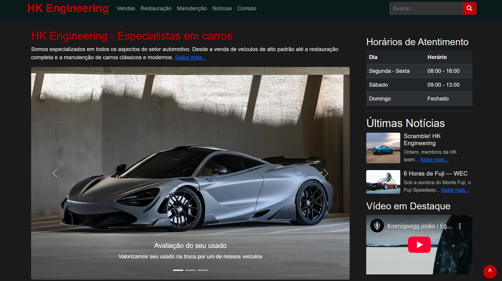
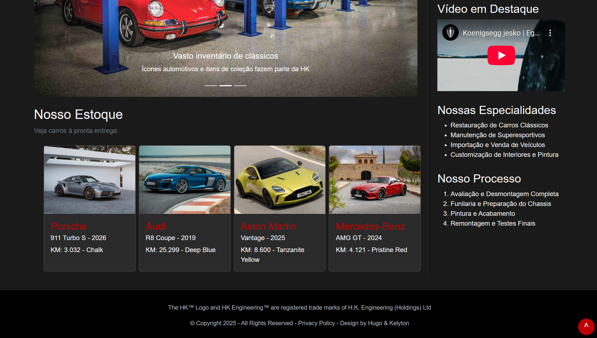
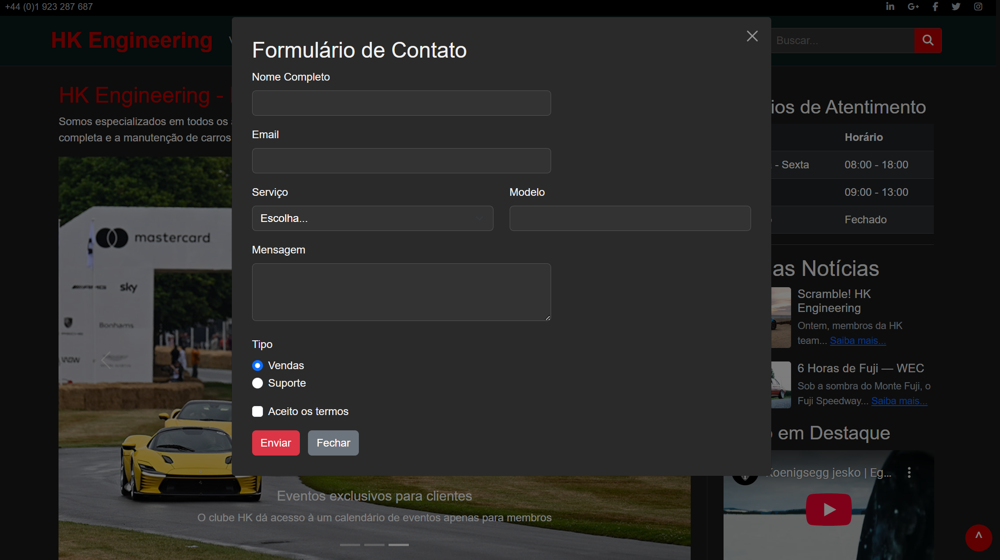

# HK Engineering (Trabalho 1 TDS)

Este é um projeto *client-side* para a disciplina de "Tecnologias de Desenvolvimento de Software". Trata-se de um site front-end para uma empresa fictícia de engenharia e vendas de carros de luxo e clássicos, a "HK Engineering".

O objetivo principal era aplicar conceitos de HTML5, CSS3, Bootstrap e JavaScript para criar uma aplicação web interativa e modular.

#### Autores:
- [Hugo Cordeiro](https://github.com/ugoincc)
- [Kelyton Lacerda](https://github.com/Kelyton21)


## Guia Visual (Screenshots)

| Página Principal (Topo) | Página Principal (Estoque) | Formulário Modal |
| :---: | :---: | :---: |
|  |  |  |

## Funcionalidades Principais

Este projeto não é apenas um site estático. Ele utiliza JavaScript para criar uma experiência modular e dinâmica:

* **Carregamento Modular de Componentes**
    O arquivo `index.html` é apenas um "shell". O `main.js` usa a função `fetch()` para carregar dinamicamente as partes reutilizáveis do site (como `header.html`, `footer.html` e `content.html`) assim que a página é carregada.

* **Renderização Dinâmica do Estoque**
    A seção "Nosso Estoque" não é "hardcoded" no HTML. Ela é gerada pelo JavaScript. A função `populateEstoque()` lê um array de objetos `availableCars`, itera sobre ele, e cria os *cards* do Bootstrap para cada carro, inserindo-os no DOM.

* **Interatividade com Bootstrap**
    O site utiliza componentes avançados do Bootstrap 5, como:
    * **Navbar:** Um menu de navegação responsivo.
    * **Carousel:** Para o banner principal da página.
    * **Modal:** O formulário de contato é carregado dentro de um Modal, que é ativado pelo link "Contato" no menu.

* **Design Responsivo**
    O layout de duas colunas (conteúdo principal e barra lateral) se adapta a telas menores, empilhando as colunas verticalmente. Um aviso sobre a melhor visualização em telas maiores é exibido em dispositivos móveis.

## Tecnologias Utilizadas

* **HTML5** (Estrutura modular com parciais)
* **CSS3** (Tema escuro customizado, layout responsivo)
* **JavaScript (ES6+)** (Fetch API, manipulação do DOM,
    renderização de arrays)
* **Bootstrap 5** (Componentes, Grid System, Utilities)
* **Font Awesome** (Ícones)

## Como Executar

Este projeto usa `fetch()` em JavaScript para carregar os componentes HTML. Devido às políticas de segurança (CORS) dos navegadores, ele **não funcionará** abrindo o `index.html` diretamente (via `file://`).

Você **precisa** servi-lo a partir de um servidor HTTP local.

### 1. Com a extensão Live Server (VS Code)

1.  Instale a extensão [Live Server](https://marketplace.visualstudio.com/items?itemName=ritwickdey.LiveServer) no VS Code.
2.  Abra a pasta do projeto.
3.  Clique com o botão direito no `index.html` e escolha "Open with Live Server".

### 2. Com Python

Se você tem Python instalado, navegue até a pasta do projeto no terminal e execute:

```
# Para Python 3
python3 -m http.server 8000
```

Acesse http://localhost:8000 no seu navegador.

### 3. Com Node.js
Se você tem o Node.js, pode usar o pacote serve:

```
# Instale o pacote (apenas uma vez)
npm install -g serve

# Rode na pasta do projeto
npx serve .
```

Acesse o endereço que aparecerá no terminal (geralmente http://localhost:3000).
